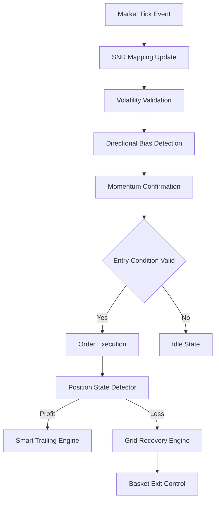
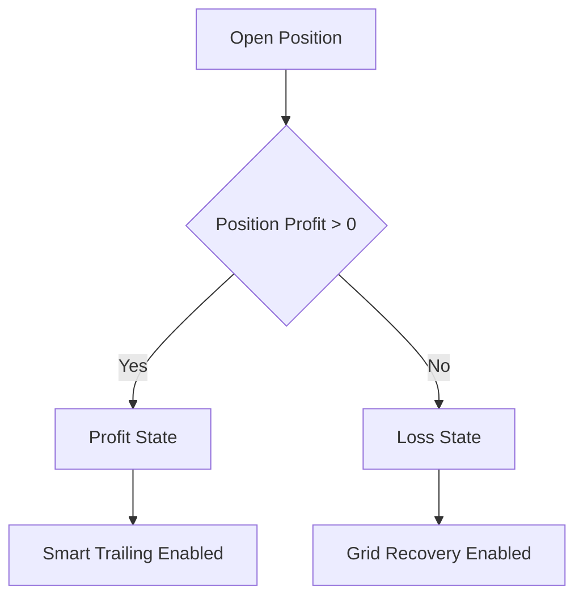

# **Designing a State-Driven Support and Resistance Trading System** 

### *SR Mapping Foundation v7.1 — A Risk-Governed Expert Advisor Architecture*

---

## Abstract

Sebagian besar Expert Advisor berbasis Support dan Resistance gagal mempertahankan stabilitas ekuitas karena konflik antar mekanisme exit, penggunaan grid tanpa kontrol margin, serta kurangnya adaptasi terhadap kondisi volatilitas pasar.

Artikel ini memperkenalkan **SR Mapping Foundation v7.1**, sebuah Expert Advisor berbasis arsitektur *state-driven trading engine* yang mengintegrasikan:

* Dynamic Support & Resistance mapping berbasis fractal,
* Momentum confirmation menggunakan RSI,
* Volatility regime filtering melalui ATR,
* Directional bias harian,
* Mutual-exclusive exit engine,
* serta Risk Governor berbasis margin awareness.

Pendekatan ini memisahkan fase *profit protection* dan *loss recovery*, sehingga sistem dapat beradaptasi terhadap perubahan kondisi pasar tanpa konflik logika internal.

---

## 1. Introduction

Pendekatan tradisional dalam pengembangan EA biasanya berfokus pada pencarian sinyal entry terbaik. Namun dalam praktik nyata, stabilitas sistem trading lebih banyak ditentukan oleh:

* bagaimana posisi dikelola setelah entry,
* bagaimana sistem merespons kerugian,
* dan bagaimana risiko struktural dikontrol.

Mayoritas EA retail menjalankan trailing stop, grid, dan stop loss secara simultan. Hal ini menciptakan konflik algoritmik yang sering menghasilkan:

* over-trading,
* margin exhaustion,
* dan equity collapse.

SR Mapping Foundation dikembangkan dengan filosofi berbeda:

> **Market behavior should determine exit behavior.**

---

## 2. System Architecture

Arsitektur EA dibangun sebagai pipeline keputusan berlapis.



Pendekatan ini memastikan setiap keputusan trading melewati serangkaian filter independen.

---

## 3. Dynamic Support and Resistance Mapping

Level Support dan Resistance tidak ditentukan secara manual, melainkan dibangun ulang secara periodik menggunakan indikator fractal.

### Principle

* Fractal upper → resistance candidate
* Fractal lower → support candidate
* Level diwariskan ke bar berikutnya hingga terbentuk struktur baru.

Metode ini memungkinkan EA mengikuti perubahan struktur pasar secara real-time.

---

## 4. Multi-Layer Entry Validation

Entry hanya terjadi jika seluruh kondisi berikut terpenuhi.

### 4.1 Trading Session Filter

Entry dibatasi pada jam trading tertentu berdasarkan broker time.

Tujuan utama:

* menghindari spread ekstrem,
* mengurangi aktivitas pada fase likuiditas rendah.

---

### 4.2 Volatility Regime Filter (ATR)

ATR digunakan sebagai validator kondisi pasar:

| Kondisi    | Interpretasi           |
| ---------- | ---------------------- |
| ATR rendah | Market stagnan         |
| ATR tinggi | Market terlalu agresif |
| ATR ideal  | Trading allowed        |

EA hanya beroperasi pada zona volatilitas optimal.

---

### 4.3 Daily Directional Bias

Arah market ditentukan berdasarkan jarak harga terhadap open harian.

* Range positif besar → bullish bias
* Range negatif besar → bearish bias

Hal ini mencegah sistem melawan momentum dominan.

---

### 4.4 RSI Momentum Timing

RSI digunakan sebagai *timing mechanism*.

BUY condition:

```
Price near Support
AND RSI Oversold
AND Bullish Daily Bias
```

SELL condition berlaku sebaliknya.

---

## 5. State-Driven Exit Engine

Inovasi utama sistem ini adalah pemisahan perilaku exit berdasarkan kondisi posisi.



### Profit State

* Grid dinonaktifkan.
* Trailing stop adaptif aktif.
* Profit diamankan secara bertahap.

### Loss State

* Trailing dinonaktifkan.
* Grid averaging diaktifkan.
* Recovery dilakukan secara terkontrol.

Pendekatan ini menghilangkan konflik exit logic.

---

## 6. Risk Governor Mechanism

Grid tradisional sering gagal karena tidak memperhitungkan margin tersisa.

SR Mapping menerapkan margin gate:

```
Free Margin > Required Margin × 1.3
```

Jika tidak terpenuhi, order grid diblok.

Ini mencegah eskalasi risiko eksponensial.

---

## 7. Adaptive ATR-Based Protection

Stop Loss dan Take Profit dapat menyesuaikan volatilitas:

```
SL = ATR × Multiplier
TP = ATR × Multiplier
```

Keuntungan utama:

* konsisten di berbagai kondisi market,
* menghindari SL terlalu sempit saat volatilitas tinggi.

---

## 8. Basket Exit Logic

Saat beberapa posisi grid aktif:

```
Total Basket Profit ≥ Target
→ Close All Positions
```

Pendekatan ini mengubah grid menjadi mekanisme recovery siklik, bukan eksposur permanen.

---

## 9. Computational Optimization

EA dirancang dengan efisiensi CPU tinggi:

* indikator dicache per bar,
* rebuild SNR hanya saat bar baru,
* panel update throttling,
* retry execution mechanism.

---

## 10. Conclusion

SR Mapping Foundation v7.1 menunjukkan bahwa stabilitas sistem trading tidak berasal dari kompleksitas indikator, melainkan dari desain arsitektur keputusan.

Dengan memisahkan fase profit dan loss menjadi state independen, sistem mampu:

* beradaptasi terhadap perubahan market,
* menjaga efisiensi margin,
* dan mengurangi konflik internal algoritma.

---


